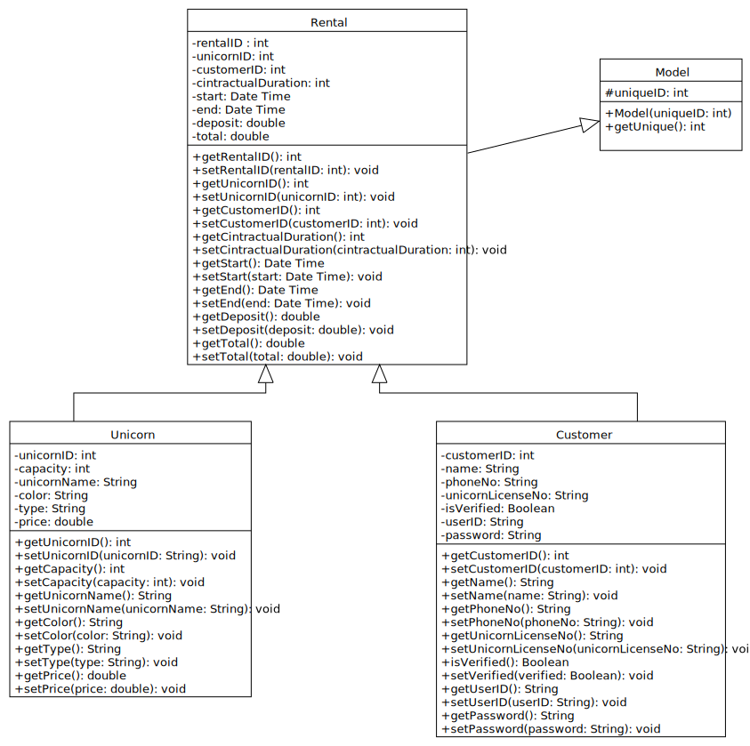

# UTeM-UnicornRentalManagementSystem-OOP
Final Project for our Object Oriented Programming (OOP) subject.

---

# Unicorn Rental Management System
Unicorns are fun animals to have at parties, expecially when they are mystic and rarely being able to find. To cater with such requirements and demands, `Unicorn Corp` -- the one and only unicorn rental company in the world was found.  
As time builds up, they are facing higher and higher demands for unicorn rentals. However, as records are being done manually, there are difficulties when analytics is required, or when data has to be searched. This has lead to overtime workings for employees, and unicorns are lost due to inconsistent records.  
Being one of the most innovative companies in the world,`Unicorn Corp` strives to provide the best for their employees, customers and shareholders.   
As such, `Unicorn Corp` wants to develop a Unicorn Rental system for its front desk employees, to quickly assign and rent out unicorns, while keeping close track towards company asset.  
The system keeps track of the unicorns owned by the company, and the rentals being done by each customer. A system adhering to the following requirements needs to be done:
1. The unicorns owned by the company must be registered under `unicorn profiles`, and from different metrics determine whether they are fit to be rented, or if they are available to be rented. There should also be a list clearly stating which unicorns are available to be rented.
1. `Customer profiles` have to be kept so that we know if a customer has bad track record (e.g. unicorn abuse) and increase responsibility.
1. `Rental records` will also need to be done to prevent disputes that arise.

## Class diagram
During the requirements analysis phase, our system analyst came out with a class diagram, which is to be implemented by out developers. The class diagram can be referred to below:  

